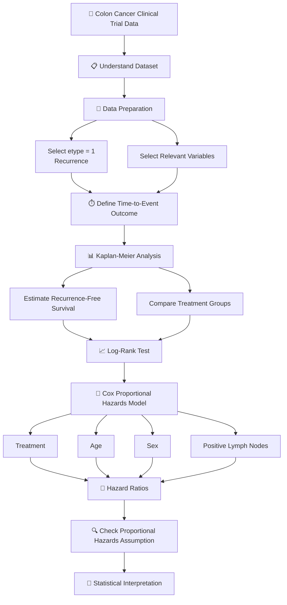

# 🧬 Clinical Trial Survival Analysis in R

### Adjuvant Chemotherapy and Time-to-Recurrence in Colon Cancer

<p align="center">

**📊 Survival Analysis • 🧪 Clinical Trial Data • 📈 R Statistics • 💊 Pharmaceutical Analytics**

</p>

---

## 🎯 Project Overview

This project demonstrates the application of **survival analysis techniques in R** to study **time to recurrence** among colon cancer patients receiving different adjuvant chemotherapy treatments.

The analysis uses the `colon` dataset available through R's **`survival` package**.

The main objective is to understand how **time until recurrence** varies across treatment groups while also considering important patient characteristics such as age, sex, and the number of positive lymph nodes.

---

## 🧩 Project Workflow



---

# 🧪 Clinical Question

### Main Question

> **Is time to cancer recurrence associated with treatment group and patient characteristics?**

The analysis focuses on:

* **Treatment group**
* **Time until recurrence**
* **Censoring**
* **Age**
* **Sex**
* **Number of positive lymph nodes**

---

# 📂 Dataset

The project uses the `colon` dataset from the R **`survival`** package.

The dataset contains information from a clinical trial involving patients with colon cancer and different treatment groups.

### Treatment Groups

| Treatment | Description                 |
| --------- | --------------------------- |
| `Obs`     | Observation / control group |
| `Lev`     | Levamisole                  |
| `Lev+5FU` | Levamisole + 5-FU           |

> **Note:** `Obs` represents the observation/control group; it is not treated as a drug.

---

# 🔎 Preparing the Recurrence Dataset

The dataset contains different event types.

For this project, we focus specifically on **recurrence**.

```r
library(survival)

data(colon)

recurrence <- subset(colon, etype == 1)
recurrence <- recurrence(, c( "id", "age", "sex", "status", "etype", "nodes", "rx")
recurrence

# dataset is now recurrence not a colon.


```

### Selected Variables

| Variable | Meaning                        |
| -------- | ------------------------------ |
| `rx`     | Treatment group                |
| `time`   | Follow-up time                 |
| `status` | Recurrence/event indicator     |
| `age`    | Patient age                    |
| `sex`    | Patient sex                    |
| `nodes`  | Number of positive lymph nodes |

---

# ⏱️ Why Survival Analysis?

A normal regression model is not ideal for this problem because some patients **do not experience recurrence during the observed follow-up period**.

For example:

```text
Patient A → Recurrence after 800 days
Patient B → Recurrence after 500 days
Patient C → No recurrence observed for 900 days
```

For Patient C, we don't know the actual recurrence time.

This is called **right censoring**.

Therefore, survival analysis allows us to use both:

```text
Time information + Event/Censoring information
```

---

# 📊 Step 1 — Kaplan-Meier Analysis

The Kaplan-Meier method estimates the probability of remaining recurrence-free over time.

```r
surv_obj <- Surv(
  time = recurrence$time,
  event = recurrence$status
)

km_model <- survfit(
  surv_obj ~ rx,
  data = recurrence
)

plot(
  km_model,
  xlab = "Time",
  ylab = "Recurrence-Free Survival Probability",
  main = "Kaplan-Meier Curves by Treatment"
)
```

### Question answered

> **How does recurrence-free survival change over time for each treatment group?**

---

# 📈 Step 2 — Log-Rank Test

The log-rank test provides a formal comparison of the survival curves.

```r
survdiff(
  Surv(time, status) ~ rx,
  data = recurrence
)
```

### Question answered

> **Is there statistical evidence that the recurrence-free survival curves differ between treatment groups?**

---

# 🧮 Step 3 — Cox Proportional Hazards Model

The Cox model examines the association between patient characteristics and the **hazard of recurrence**.

```r
cox_model <- coxph(
  Surv(time, status) ~ rx + age + sex + nodes,
  data = recurrence
)

summary(cox_model)
```

Hazard ratios can be obtained using:

```r
exp(coef(cox_model))
```

Confidence intervals:

```r
exp(confint(cox_model))
```


# 📌 Hazard Ratio

The hazard ratio is:

$$
HR = e^\beta
$$

Interpretation:

| HR     | Interpretation                                |
| ------ | --------------------------------------------- |
| HR = 1 | No estimated difference in hazard             |
| HR < 1 | Lower estimated hazard relative to reference  |
| HR > 1 | Higher estimated hazard relative to reference |

---

# 🔬 Step 4 — Proportional Hazards Assumption

The Cox model assumes that the **relative hazard between groups remains approximately constant over time**.

This can be examined using:

```r
ph_test <- cox.zph(cox_model)

ph_test

plot(ph_test)
```

The `cox.zph()` test helps assess whether the proportional hazards assumption is reasonable.

---

# 🧠 Statistical Methods Used

```text
                    Clinical Trial Data
                           │
                           ▼
                  Data Preparation
                           │
                           ▼
                  Kaplan-Meier Method
                           │
                           ▼
                    Log-Rank Test
                           │
                           ▼
               Cox Proportional Hazards
                           │
                           ▼
                    Hazard Ratios
                           │
                           ▼
              PH Assumption Checking
```

### Methods Summary

| Method         | Main Purpose                                            |
| -------------- | ------------------------------------------------------- |
| Kaplan-Meier   | Estimate survival/recurrence-free probability over time |
| Log-rank test  | Compare survival curves                                 |
| Cox regression | Estimate association with recurrence hazard             |
| Hazard Ratio   | Quantify relative hazard                                |
| `cox.zph()`    | Check proportional hazards assumption                   |

---

# 💻 R Packages

```r
library(survival)
```

The primary analysis is performed using the **`survival`** package in R.

---

# 🗂️ Suggested Project Structure

```text
Clinical-Trial-Survival-Analysis/
│
├── README.md
│
├── R/
│   ├── 01_data_preparation.R
│   ├── 02_kaplan_meier.R
│   ├── 03_log_rank_test.R
│   ├── 04_cox_model.R
│   └── 05_ph_assumption.R
│
├── figures/
│   ├── kaplan_meier.png
│   └── ph_assumption.png
│
└── report/
    └── survival_analysis_report.pdf
```

---

# 📌 Key Learning Outcomes

Through this project, the following concepts are demonstrated:

* Clinical trial data preparation
* Time-to-event analysis
* Right censoring
* Kaplan-Meier estimation
* Survival curve comparison
* Log-rank testing
* Cox proportional hazards regression
* Hazard ratios
* Confidence intervals
* Proportional hazards assumption
* Interpretation of survival-analysis results using R

---

# ⚠️ Important Statistical Note

The Cox model estimates **associations** between treatment/patient characteristics and recurrence hazard.

The statistical results should therefore be interpreted according to the study design and model assumptions rather than automatically being described as proof of a causal treatment effect.

---

# 🧰 Tools & Technologies

<p align="center">

`R` • `RStudio` • `survival` • `Statistics` • `Survival Analysis` • `Clinical Trial Analytics`

</p>

---

## 👨‍💻 Author

**Kapil Gunde**

M.Sc. Statistics
Banaras Hindu University (BHU)

---

## ⭐ Project Focus

> **Using statistical survival-analysis methods in R to understand time-to-recurrence patterns in clinical trial data.**

---
